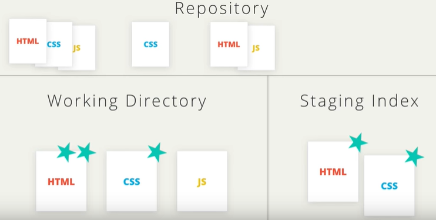
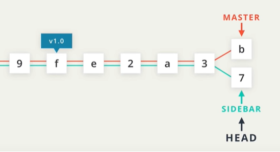
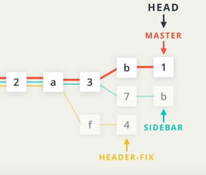
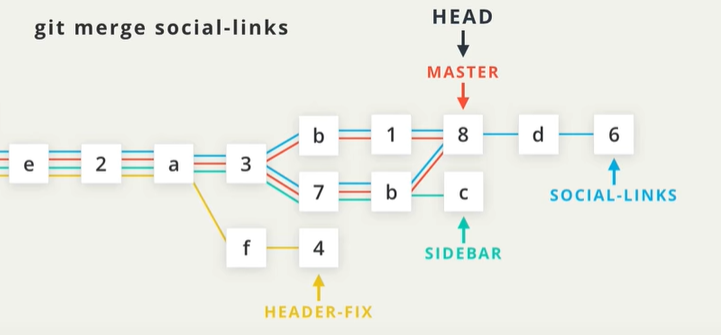
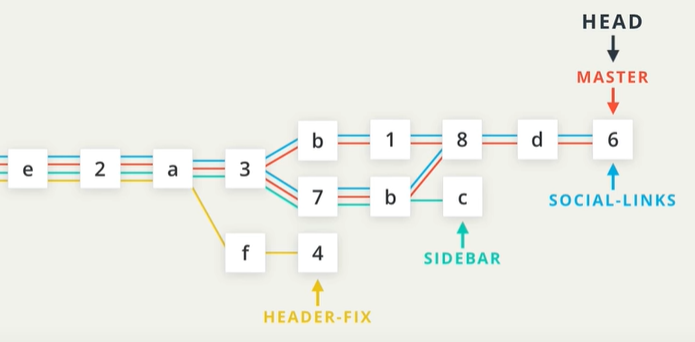
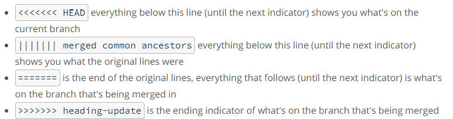

# Git

Git is a distributed version-control system for tracking changes in source code during software development [...](https://en.wikipedia.org/wiki/Git)

## Git vs GitHub vs GitLab

Git is a version control system that lets you manage and keep track of your source code history. GitHub is a cloud-based hosting service that lets you manage Git repositories.

Both [GitHub and GitLab](https://about.gitlab.com/devops-tools/github-vs-gitlab.html) are cloud-based hosting service for your git repositories.

## Terminology

### commit

Git thinks of its data like a set of snapshots of a mini filesystem. Every time you commit (save the state of your project in Git), it basically takes a picture of what all your files look like at that moment and stores a reference to that snapshot. So a commit is the fundamental unit in Git



### repo

A repository is a directory which contains your project work which are used to communicate with Git. Repositories can exist either locally on your computer or as a remote copy on another computer.

### Working directory

The Working Directory is the files that you see in your computer's file system.

### checkout

A checkout is when content in the repository has been copied to the Working Directory.

### Staging Area / Staging Index / Staging / Index

A file in the Git directory that stores information about what will go into your next commit.

### SHA

"SHA" is shorthand for "Secure Hash Algorithm". It is a 40-character string composed of characters (0–9 and a–f) and calculated based on the contents of a file or directory structure in Git.

### Branch

A branch is when a new line of development is created that diverges from the main line of development. This alternative line of development can continue without altering the main line.

## Create a repo from scratch

`git init`

Running the git init command sets up all of the necessary files and directories that Git will use to keep track of everything. All of these files are stored in a directory called [.git](https://git-scm.com/book/en/v2/Git-Internals-Plumbing-and-Porcelain)

config - where all project specific configuration are stored

description - only used for git web

HEAD - points to the checked out branch

hooks/ - this is where we could place client-side or server-side scripts [...](https://git-scm.com/book/en/v2/Customizing-Git-Git-Hooks)

info/ - contains the global excludes file

objects/ - contains all the commits we make

refs/ - contains pointers to commits (basically the "branches" and "tags")

`git init` [docs](https://git-scm.com/docs/git-init)

## Clone an existing repo

`git clone <URL of repo>`

`git clone <URL of repo> <New repo name>`

`git clone` [docs](https://git-scm.com/docs/git-clone)

## Status of the repo

The git status is our key to the mind of Git. It will tell us what Git is thinking and the state of our repository as Git sees it

`git status`

`git status` [docs](https://git-scm.com/docs/git-status)

## Displaying repo commits

`git log`

By default, this command displays:

- the SHA
- the author
- the date
- and the message

Truncate and display commits in oneline:

`git log --oneline`

- lists one commit per line
- shows the first 7 characters of the commit's SHA
- shows the commit's message

To answer the questions like, what files were changed? How was it changed?

`git log --stat`

- displays the file(s) that have been modified
- displays the number of lines that have been added/removed
- displays a summary line with the total number of modified files and lines that have been added/removed

The `git log` command has a flag that can be used to display the actual changes made to a file.

`git log -p` or `git log --patch`

- displays the files that have been modified
- displays the location of the lines that have been added/removed
- displays the actual changes that have been made

`git log -p --stat` will display the stats info above the patch info

`git log -p -w` will show the patch information, but will not highlight lines where only whitespace changes have occurred.

Avoid too much scrolling by just viewing a specific commit. There is two ways to accomplish that,

`git log -p <SHA>`

By supplying a SHA, the git log -p command will start at that commit. Just so you know, it will also show all of the commits that were made prior to the supplied SHA.

The other command that can be used to display commit is `git show`

`git show`

The above command will display the most recent commit

`git show <SHA>`

The above command displays the commit associated with the SHA.

`git show --stat 8aa6668`

The output of the git show command is exactly the same as the git log -p command. So by default, git show displays:

- the commit
- the author
- the date
- the commit message
- the patch information

## Commit to a repo

### Git Add

The `git add` command is used to move files from the Working Directory to the Staging Index.

`git add <file1> <file2> … <fileN>`

- takes a space-separated list of file names
- the period . can be used in place of a list of files to tell Git to add the current directory (and all nested files)

`git rm --cached <file>` will not destroy any of your work; it just removes it from the Staging Index.
`git rm --cached -r .` will recursively removes everything from Staging Index.

### Some useful references

- First time [git setup](https://git-scm.com/book/en/v2/Getting-Started-First-Time-Git-Setup)
- Associating [text editors](https://help.github.com/en/github/using-git/associating-text-editors-with-git) with git

### Git Commit

The git commit command takes files from the Staging Index and saves them in the repository.

After setting up the favorite editor in the config, run `git commit`

`git commit -m` to skip opening the editor for commit message.

Writing better commit messages

- stick to 60 chars or less
- be consistent

Do

- keep the message short (less than 60-ish characters)
- explain what the commit does (not how or why!)

Do not

- explain why the changes are made
- explain how the changes are made (that's what git log -p is for!)
- do not use the word "and" (if that is the case, there are too many changes to commit)

Here's an example of [commit message standard](https://udacity.github.io/git-styleguide/)

### Git Diff

The git diff command can be used to see changes that have been made but haven't been committed, yet.

`git diff`

This command displays:

- the files that have been modified
- the location of the lines that have been added/removed
- the actual changes that have been made

`git diff` [docs](https://git-scm.com/docs/git-diff)

### Git Ignore

Create a `.gitignore` file where the .git resides

Using globbing we can leverage `.gitignore` to exclude files with pattern.

```text
 blank line - matches no files, can be used for readability

 # - marks line as a comment

 * - matches 0 or more characters

 ? - matches 1 character

 [abc] - matches a, b, or c

 - matches nested directories - a/**/z matches
    a/z
    a/b/z
    a/b/c/z
```

`.gitignore` [docs](https://git-scm.com/docs/gitignore#_pattern_format)

## Tagging, Branching, Merging

### Git Tag

Tags let you point out particular commit to stand out from others.

`git tag v1.0` - create a lightweight tag

`git tag -a v1.0` - creates an annotated tag

Annotated tags are recommended because they include a lot of extra information such as:

- the person who made the tag
- the date the tag was made
- a message for the tag

To verify the tag added to the repository, just type `git tag`

Use `git log` or `git log --decorate` for git 2.13 and older. The output looks like:

`commit 67b71812c337f10c1e25d5469967e1f904e0a757 (HEAD -> master, tag: 1.0)`

HEAD -> master is the information about branch

A Git tag can be deleted with the -d flag

`git tag -d v1.0`

Adding a tag to a past commit

`git tag -a v1.0 SHA`

`git tag` from [book](https://git-scm.com/book/en/v2/Git-Basics-Tagging)
`git tag` (docs)[https://git-scm.com/docs/git-tag]

### Git Branch

Branches in Git are flexible and lets you do powerful things.



HEAD - points to the current or active branch

We can fix the problem by creating a branch.



Create a branch:

`git branch <branchName>`

`git branch <branchName> <SHA>`

List all branches:

`git branch`

Switch between branches:

`git checkout <branchName>`

Delete a branch:

`git branch -d <branchName>`

Note:
git checkout will remove all files and directories from the Working Directory that Git is tracking
(be assured that nothing is lost - they are stored in the repository)

Here's and interactive website to learn [git branching](https://learngitbranching.js.org/)
`git branch` [book](https://git-scm.com/book/en/v2/Git-Branching-Basic-Branching-and-Merging)

Useful git log command for viewing all the branches (commits)

`git log --oneline --decorate --graph --all`

### Git Merge

- Combining branches together is called merging.
- It's important to know which branch you're on when you're about to merge branches together.
- Making a merge makes a commit.

When a merge happens, Git will:

- look at the branches that it's going to merge
- look back along the branch's history to find a single commit that both branches have in their commit history
- combine the lines of code that were changed on the separate branches together
- makes a commit to record the merge

Note:
When we merge, we're merging some other branch into the current (checked-out) branch. We're not merging two branches into a new branch. We're not merging the current branch into the other branch.

Types of merge:

- Fast-forward merge (simplest of all merges)
- Regular merge

Fast-forward merge illustrated:

- the branch being merged in must be ahead of the checked out branch.
- Fast-forward merge will just move the currently checked out branch forward until it points to the same commit that the other branch





Regular merge:

- two divergent branches are combined
- a merge commit is created

Git branching [book](https://git-scm.com/book/en/v2/Git-Branching-Basic-Branching-and-Merging)

### Merge Conflict

What causes it?

- Git tracks lines in files
- Merge conflicts happen when the exact same lines are change in seperate branches.

The editor has the following merge conflict indicators:



Merge conflict indicator [docs](https://git-scm.com/docs/git-merge#_how_conflicts_are_presented)

## Undoing

### Modifying the last commit

`git commit --amend` will let you provide a new commit message.

We can also add forgotten files to commit using `git commit --amend`

To include files to the commit:

- edit the file
- stage the file
- run `git commit --amend`
